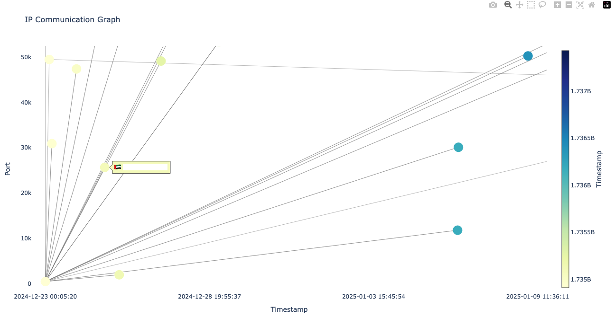
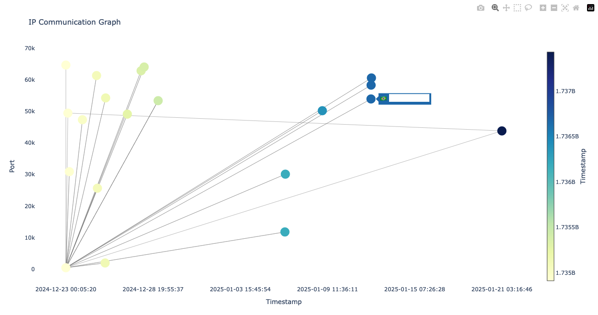

# NetMermaid: Interactive IP Communication Visualization

NetMermaid is a Python package that visualizes network communication between IP addresses using Plotly for interactive graphing. It processes CSV data of IP flows, with a special focus on source and destination ports, and outputs a dual-axis graph with country flags for IPs.

NetMermaid is designed to help analysts visually represent and identify recurring IP connections that might otherwise be difficult to discern in raw CSV data. By transforming complex network flow records into an interactive graph, it highlights key connections and pivotal IPs that play critical roles in network communications. This visualization enables analysts to quickly spot repeating patterns, trace communications across multiple devices or regions, and uncover potential anomalies. It serves as a powerful tool for simplifying the analysis of large volumes of IP data, offering insights that can be challenging to extract from traditional CSV reports.

## Features
- **Interactive Visualization**: Graphing of IP communications with dynamic, human-readable timestamps.
- **Dual Y-Axes**: Source ports on the left and destination ports on the right.
- **Country Flags**: Each IP node displays the respective country flag, enhancing visibility of geographic data.
Mermaid Syntax: Generates Mermaid diagram syntax for IP flows.

## Installation
### From Source
```bash
git clone https://www.github.com/ytisf/NetMermaid
cd NetMermaid
pip install -r requirements.txt
pip install .
```

### From PyPI
```bash
pip install https://pypi.org/project/NetMermaid/
```

## Usage
```python
from NetMermaid import NetMaid

csv_file_path = 'examples/C2_FullFlows.csv'

def main():
    # Initialize the NetMermaid class with the example CSV file
    netmermaid = NetMaid(csv_file_path)
    
    # Step 1: Create the graph
    netmermaid.create_graph()
    
    # Step 2: Visualize the graph (this will open a Matplotlib window)
    netmermaid.visualize()
    
    print("Generated Mermaid Syntax:")

if __name__ == "__main__":
    main()
```

### Output Example



## Contributions
Contributions are welcome! Please fork the repository and create a pull request for any new features or fixes.

## License
This project is licensed under the GNU GENERAL PUBLIC LICENSE. See the [LICENSE](LICENSE) file for details.

## Acknowledgments
- [Plotly](https://github.com/plotly/plotly.py): For interactive graphing and visualization.
- [NetworkX](https://github.com/networkx): For graph creation and manipulation.
- [PyCountry](https://github.com/pycountry): For converting country codes to flags.